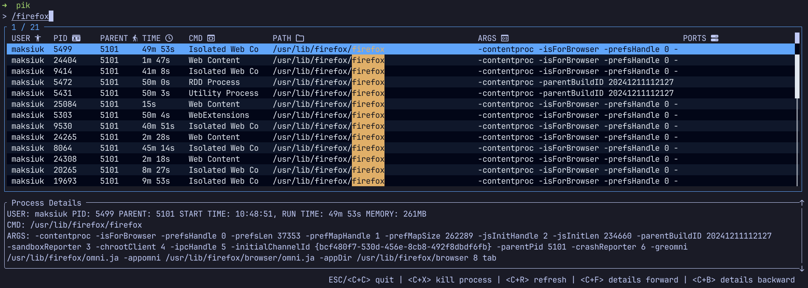

<div align="center">

<h1>
  <span style="font-size: 80px;">Pik</span>
<picture>
  <source media="(prefers-color-scheme: dark)" srcset="logo_dark.svg">
  <source media="(prefers-color-scheme: light)" srcset="logo_light.svg">
  
</picture>
</h1>

[](https://github.com/jacek-kurlit/pik/actions)
[](https://github.com/jacek-kurlit/pik/releases/latest)

</div>

Process Interactive Kill is a command line tool that helps to find and kill process.
It works like pkill command but search is interactive.


This tool is still under development

## Table of Contents

- [Table of Contents](#table-of-contents)
- [Features](#features)
- [Installation](#installation)
- [Configuration](#configuration)
  - [Application configuration](#application-configuration)
  - [Multiple meta key names support](#multiple-meta-key-names-support)
  - [Readline style support](#readline-style-support)
- [Configuration Recipes](#configuration-recipes)
  - [Minimal configuration](#minimal-configuration)
  - [macOS: ignore system libraries](#macos-ignore-system-libraries)
  - [Readline key mappings](#readline-key-mappings)
- [Migration Guides](#migration-guides)
  - [0.30.x to 1.0](#030x-to-10)
- [Caveats](#caveats)
- [Development](#development)
  - [Supported Systems](#supported-systems)
  - [Setup](#setup)
  - [Building](#building)

## Features

Pik allows to **fuzzy** search processes by:

- Name - No prefix is required, just type process name, for example 'firefox'
  
- Cmd Path - Prefix search with '/', for example '/firefox'
  
- Arguments - Prefix search with '-' for example '-foo'. Please note that if you want to use this feature in cli you must add `--`, for example `pik -- -foo`
  
- Ports - Prefix search with ':' for example ':8080'
  
- Everywhere - Prefix search with '~' for example '~firefox'
  
- Select exact process by id - Prefix with '!' for example '!1234'
- Select process family (process + it's children) - Prefix with '@' for example '@1234'

After selecting process you can kill it with Ctrl + X

## Installation

**[Archives of precompiled binaries for pik are available for Linux, macOS and Windows.](https://github.com/jacek-kurlit/pik/releases)**

On **Arch Linux**

```sh
pacman -S pik
```

On **Fedora**

```sh
sudo dnf copr enable rusty-jack/pik
sudo dnf install pik
```

On **Tumbleweed**

```sh
sudo zypper install pik
```

On **Gentoo**

It is available via `lamdness` overlay

```sh
sudo eselect repository enable lamdness
sudo emaint -r lamdness sync
sudo emerge -av sys-process/pik
```

On **Windows** with [Scoop](https://scoop.sh)

```sh
scoop bucket add jacek-kurlit https://github.com/jacek-kurlit/scoop-bucket
scoop install pik
```

On **macOS** with [Homebrew](https://brew.sh)

```sh
brew tap jacek-kurlit/tap
brew install pik
```

On **Ubuntu** with [Snap](https://snapcraft.io/pik)

```sh
snap install pik-tui

```
If you're a **Rust programmer**, pik can be installed with `cargo`.

```sh
cargo install pik
```

Alternatively, one can use [`cargo binstall`](https://github.com/cargo-bins/cargo-binstall) to install a pik
binary directly from GitHub:

```sh
cargo binstall pik
```

## Configuration

### Application configuration

You may set your preferences in `config.toml` file located in:

| Platform | Config dir                                                                             |
| -------- | -------------------------------------------------------------------------------------- |
| Linux    | /home/_:username_/.config/pik                                                          |
| MacOS    | /home/_:username_/.config/pik or /Users/_:username_/Library/Application Support/pik    |
| Windows  | C:\Users\\_:username_\\.config\pik or C:\Users\\_:username_\AppData\Roaming\pik        |

All options are optional, if skipped default values will be used.
Some of config fields have cli arg equivalent. If both are set cli arg is preferred.
Run `pik -- --help` to see cli options
The authoritative default configuration lives in [`default_config.toml`](default_config.toml) which will be overridden with your local config. If you want to see final configuration use `pik --print-config` command.
Please refer to [config](config.md) for more details how to configure options,theme and key mappings.

### Multiple meta key names support

Pik supports combining multiple modifier keys (meta keys) in key bindings. You can use any combination of "ctrl", "alt", "shift", "super", "hyper", and "meta" modifiers together.

**Examples:**

```toml
# Single modifier
quit = "ctrl+c"

# Combined modifiers
toggle_help = "ctrl+alt+h"
toggle_debug = "ctrl+shift+d"

# Multiple bindings with different modifier combinations for the same action
toggle_help = ["ctrl+alt+h", "ctrl+shift+h", "f1"]
```

This allows for flexible keybinding configurations that can accommodate different user preferences and avoid conflicts with terminal or OS shortcuts.

## Configuration Recipes

### Minimal configuration

```toml
screen_size = "fullscreen"

[ui]
icons = "nerd_font_v3"
```

### macOS: ignore system libraries

macOS users may want to reduce noise by excluding system and application libraries from search results:

```toml
[ignore]
paths = ["/System/.*", "/Applications/.*"]
```

### Readline key mappings

Notice that you may need to adjust the other key mappings as well to avoid conflicts, and some key combinations may not work depending on your terminal emulator.

```toml
[key_mappings]
cursor_left = ["left", "ctrl+b"]
cursor_right = ["right", "ctrl+f"]
cursor_home = ["home", "ctrl+a"]
cursor_end = ["end", "ctrl+e"]
cursor_word_left = ["alt+b"]
cursor_word_right = ["alt+f"]
delete_char = ["backspace", "ctrl+h"]
delete_next_char = ["delete", "ctrl+d"]
delete_word = ["ctrl+w"]
delete_next_word = ["alt+d"]
delete_to_start = ["ctrl+u"]
delete_to_end = ["ctrl+k"]
```

## Migration Guides

### 0.30.x to 1.0

Version 1.0 contains an embedded [`default_config.toml`](default_config.toml) that is merged with your local config file. In some cases the merge result may not be what you intended.

**Example:**

Default config:

```toml
[ui.process_table.cell]
highlighted = { bg = "Yellow", add_modifier = "ITALIC" }
```

Your local config:

```toml
[ui.process_table.cell]
highlighted = { bg = "Red" }
```

Resolved result:

```toml
[ui.process_table.cell]
highlighted = { bg = "Red", add_modifier = "ITALIC" }
```

If you meant to remove a field inherited from the default config, you must be explicit about it:

```toml
highlighted = { bg = "Red", add_modifier = "" }
```

To inspect your fully resolved configuration, run `pik -P`.

## Caveats

- Process name on linux system it is not always exe name also it is limited to 15 chars
- In linux process may appear on list but you are not allowed to get information about ports it uses. In such situations you need to run pik with root privileges

## Development

### Supported Systems

In theory pik is using coross compliant lib that allows to run it on all major platforms.
In pratice I'm using linux and development is performed based on this OS.
Pik will probably work on MacOs and Windows but that must be tested by community since I don't own computers with these OS'es.
If you are able to test it on windows or macos please create issue to let me know.

### Setup

- Rust 1.79+
- Cargo make [link](https://github.com/sagiegurari/cargo-make)
- Cargo nextest [link](https://github.com/nextest-rs/nextest)
- VHS [link](https://github.com/charmbracelet/vhs)

### Building

```sh
git clone https://github.com/jacek-kurlit/pik
cd pik
cargo build --release
./target/release/pik --version
```
