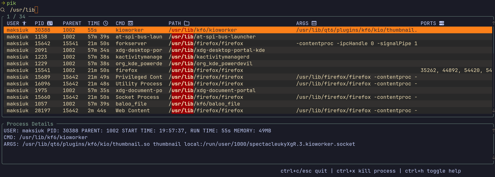
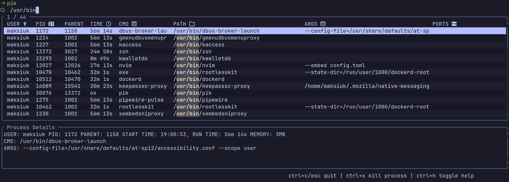
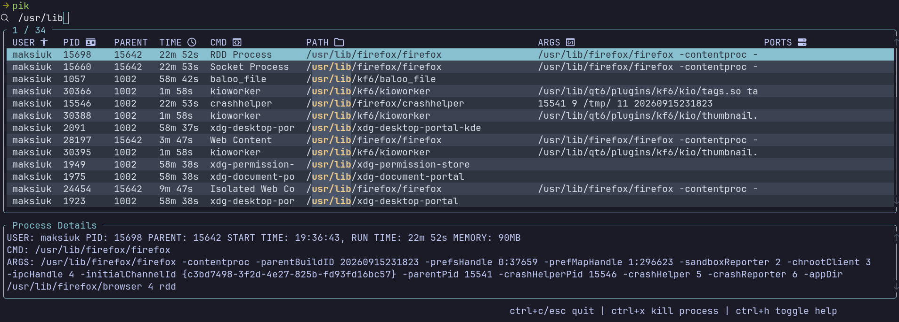

# Configuration Recipes

Ready-to-use `config.toml` snippets. Every recipe here is a **partial** config: pik embeds
[`default_config.toml`](default_config.toml) and deep-merges your file on top of it, so you only write
the fields you want to change. For the full list of fields see [config.md](config.md).

**Where the file goes**

| Platform | Config file                                                                                          |
| -------- | ---------------------------------------------------------------------------------------------------- |
| Linux    | `~/.config/pik/config.toml`                                                                          |
| macOS    | `~/.config/pik/config.toml` or `~/Library/Application Support/pik/config.toml`                       |
| Windows  | `C:\Users\<username>\.config\pik\config.toml` or `C:\Users\<username>\AppData\Roaming\pik\config.toml` |

After editing, run `pik -P` (`--print-config`) to print the fully merged result — it is also the
quickest way to find a field name you want to override.

**Two merge rules worth knowing before you copy anything:**

- Tables merge field by field, so an omitted field keeps its default. To *remove* an inherited value
  you must be explicit: `add_modifier = ""` clears modifiers, `fg = "Reset"` clears a color.
- Arrays replace wholesale. Rebinding `next_item` replaces the whole default list, so repeat any of
  the default keys you want to keep.

## Table of Contents

- [Minimal configuration](#minimal-configuration)
- [Ignoring processes](#ignoring-processes)
  - [macOS: ignore system and application libraries](#macos-ignore-system-and-application-libraries)
  - [Show every process on the machine](#show-every-process-on-the-machine)
- [Key mappings](#key-mappings)
  - [Readline style editing](#readline-style-editing)
  - [Vim style navigation](#vim-style-navigation)
- [Themes](#themes)
  - [Gruvbox Dark](#gruvbox-dark)
  - [Catppuccin Mocha](#catppuccin-mocha)
  - [Nord](#nord)
  - [Terminal colors only](#terminal-colors-only)
  - [Just change the accent color](#just-change-the-accent-color)
- [Icons](#icons)
- [Compact fullscreen layout](#compact-fullscreen-layout)

## Minimal configuration

A good starting point — fullscreen viewport and nerd font icons, everything else left at defaults.

```toml
screen_size = "fullscreen"

[ui]
icons = "nerd_font_v3"
```

Use `screen_size = { height = 25 }` instead if you prefer pik to render inline, below your prompt,
using a fixed number of lines.

## Ignoring processes

### macOS: ignore system and application libraries

macOS process lists are noisy. `paths` takes a list of regexes matched against the process command
path, and a process is dropped if it matches any of them.

```toml
[ignore]
paths = [
  "/System/.*",
  "/Applications/.*",
  "/Library/Apple/.*",
  "/usr/libexec/.*",
]
```

These are [regexes](https://docs.rs/regex/latest/regex), not shell globs: `.*` matches the rest of
the path, and a plain `/Applications/` substring would match just as well because the pattern is not
anchored. Use `^/Applications/.*$` if you want an anchored match.

The same section holds the two other noise filters, both on by default:

```toml
[ignore]
threads = true      # hide Linux thread processes
other_users = true  # hide processes owned by other users
```

### Show every process on the machine

Turn both filters off to see everything, including other users' processes and Linux threads. Run pik
with `sudo` if you also want port information for processes you do not own.

```toml
[ignore]
threads = false
other_users = false
paths = []
```

The same thing without touching the config file: `pik -t false -o false`.

## Key mappings

Every binding is validated at startup: if one key ends up assigned to two actions, pik refuses to
start and tells you which actions collided. That makes remapping a package deal — freeing a key for
a new purpose means giving the action that owned it somewhere else to live. Both recipes below do
that bookkeeping for you.

Note that `cursor_word_left`, `cursor_word_right`, `delete_next_word` and `delete_to_end` have no
default binding at all, so they only work once you bind them.

### Readline style editing

Emacs/readline editing keys in the search bar. This also moves the five default bindings that would
otherwise collide (`ctrl+h`, `ctrl+f`, `ctrl+b`, `alt+f`, `alt+d`) and drops `ctrl+k` from
`previous_item` so it can delete to end of line.

```toml
[key_mappings]
cursor_left = ["left", "ctrl+b"]
cursor_right = ["right", "ctrl+f"]
cursor_home = ["home", "ctrl+a"]
cursor_end = ["end", "ctrl+e"]
cursor_word_left = ["alt+b"]
cursor_word_right = ["alt+f"]
delete_char = ["backspace", "ctrl+h"]
delete_next_char = ["delete", "ctrl+d"]
delete_word = ["ctrl+w"]
delete_next_word = ["alt+d"]
delete_to_start = ["ctrl+u"]
delete_to_end = ["ctrl+k"]

# displaced defaults, rehomed so nothing collides
next_item = ["down", "tab", "ctrl+n"]
previous_item = ["up", "shift+backtab", "ctrl+p"]
scroll_process_details_down = ["alt+j"]
scroll_process_details_up = ["alt+k"]
select_process_family = ["ctrl+alt+f"]
toggle_help = ["f1"]
toggle_debug = ["ctrl+alt+d"]
```

Some of these combinations are swallowed by the terminal emulator before pik ever sees them —
`alt+f` and `alt+b` in particular. Check with `ctrl+alt+d` (debug view) if a key seems dead.

### Vim style navigation

`ctrl+j`/`ctrl+k` already move the selection by default. This recipe adds `ctrl+d`/`ctrl+u` for
bigger jumps and `gg`/`G`-flavoured first/last item on `alt+g`/`alt+shift+G`.

```toml
[key_mappings]
next_item = ["down", "tab", "ctrl+j", "ctrl+n"]
previous_item = ["up", "shift+backtab", "ctrl+k", "ctrl+p"]
jump_ten_next_items = ["pagedown", "ctrl+d"]
jump_ten_previous_items = ["pageup", "ctrl+u"]
go_to_first_item = ["ctrl+up", "ctrl+home", "alt+g"]
go_to_last_item = ["ctrl+down", "ctrl+end", "alt+shift+G"]

# ctrl+u is delete_to_start in the defaults, so it needs a new home
delete_to_start = ["ctrl+alt+u"]
```

Two rules this recipe leans on:

- A plain letter cannot be bound. `go_to_first_item = ["g"]` fails at startup with *"uses a single
  character without modifiers, which is generally disallowed"* — otherwise typing `g` in the search
  bar would trigger the action instead of the search. Hence `alt+g`.
- When you combine `shift` with a letter, write the letter **uppercase**: `"alt+shift+G"`. Terminals
  report the shifted key as `G`, so a binding written as `"alt+shift+g"` parses fine and then never
  matches anything.

## Themes

Each theme below is complete: table, details pane, search bar, popups and notifications. Drop one in
whole. Colors accept `#rrggbb` hex or names like `"Yellow"`, `"LightBlue"`, `"Reset"`.

One field does double duty: `ui.search_bar.cursor_style.bg` is also sent to the terminal as the
cursor color (OSC 12) while pik runs, and restored on exit.

**If you are writing your own theme, one rule matters more than the rest:** `row.selected.fg` must
differ from `cell.highlighted.bg`. The selected-row style is *patched over* the already-styled cells,
so on the selected row a search match ends up with `fg` from `row.selected` and `bg` from
`cell.highlighted` — and `REVERSED` then swaps the two. Pick the same color for both and the matched
text renders in its own background color, i.e. invisible, on the row you are actually looking at. Each
theme below keeps those two colors at a contrast ratio of 3.4:1 or better, and marks matches with
`BOLD` as well so the cue survives even where colors collide.

### Gruvbox Dark



```toml
[ui.process_table.border]
style = { fg = "#83a598" }

[ui.process_table.row]
even = { fg = "#ebdbb2", bg = "#282828" }
odd = { fg = "#ebdbb2", bg = "#32302f" }
selected = { fg = "#fe8019", add_modifier = "REVERSED" }

[ui.process_table.cell]
highlighted = { fg = "#fbf1c7", bg = "#9d0006", add_modifier = "BOLD" }

[ui.process_table.scrollbar]
style = { fg = "#665c54" }

[ui.process_details.border]
style = { fg = "#83a598" }

[ui.process_details.scrollbar]
style = { fg = "#665c54" }

[ui.search_bar]
style = { fg = "#ebdbb2" }
cursor_style = { fg = "#282828", bg = "#fe8019", add_modifier = "" }

[ui.popups.border]
style = { fg = "#b8bb26" }

[ui.popups]
selected_row = { bg = "#3c3836", add_modifier = "BOLD" }
primary = { fg = "#83a598" }
secondary = { fg = "#928374" }

[ui.notifications.theme.border]
style = { fg = "#665c54" }

[ui.notifications.theme]
info = { fg = "#83a598" }
success = { fg = "#b8bb26" }
error = { fg = "#fb4934" }
```

### Catppuccin Mocha



```toml
[ui.process_table.border]
style = { fg = "#89b4fa" }

[ui.process_table.row]
even = { fg = "#cdd6f4", bg = "#1e1e2e" }
odd = { fg = "#cdd6f4", bg = "#181825" }
selected = { fg = "#b4befe", add_modifier = "REVERSED" }

[ui.process_table.cell]
highlighted = { fg = "#f9e2af", bg = "#45475a", add_modifier = "BOLD" }

[ui.process_table.scrollbar]
style = { fg = "#585b70" }

[ui.process_details.border]
style = { fg = "#89b4fa" }

[ui.process_details.scrollbar]
style = { fg = "#585b70" }

[ui.search_bar]
style = { fg = "#cdd6f4" }
cursor_style = { fg = "#1e1e2e", bg = "#b4befe", add_modifier = "" }

[ui.popups.border]
style = { fg = "#a6e3a1" }

[ui.popups]
selected_row = { bg = "#313244", add_modifier = "BOLD" }
primary = { fg = "#89b4fa" }
secondary = { fg = "#a6adc8" }

[ui.notifications.theme.border]
style = { fg = "#585b70" }

[ui.notifications.theme]
info = { fg = "#89b4fa" }
success = { fg = "#a6e3a1" }
error = { fg = "#f38ba8" }
```

### Nord



```toml
[ui.process_table.border]
style = { fg = "#88c0d0" }

[ui.process_table.row]
even = { fg = "#d8dee9", bg = "#2e3440" }
odd = { fg = "#d8dee9", bg = "#3b4252" }
selected = { fg = "#88c0d0", add_modifier = "REVERSED" }

[ui.process_table.cell]
highlighted = { fg = "#ebcb8b", bg = "#4c566a", add_modifier = "BOLD" }

[ui.process_table.scrollbar]
style = { fg = "#4c566a" }

[ui.process_details.border]
style = { fg = "#88c0d0" }

[ui.process_details.scrollbar]
style = { fg = "#4c566a" }

[ui.search_bar]
style = { fg = "#e5e9f0" }
cursor_style = { fg = "#2e3440", bg = "#88c0d0", add_modifier = "" }

[ui.popups.border]
style = { fg = "#a3be8c" }

[ui.popups]
selected_row = { bg = "#434c5e", add_modifier = "BOLD" }
primary = { fg = "#88c0d0" }
secondary = { fg = "#81a1c1" }

[ui.notifications.theme.border]
style = { fg = "#4c566a" }

[ui.notifications.theme]
info = { fg = "#88c0d0" }
success = { fg = "#a3be8c" }
error = { fg = "#bf616a" }
```

### Terminal colors only

No hardcoded colors — pik inherits whatever scheme your terminal uses, so it follows along when you
switch between light and dark. `"Reset"` is what clears an inherited color; leaving a field out
would keep the default hex value instead.

```toml
[ui.process_table.border]
style = { fg = "Blue" }

[ui.process_table.row]
even = { fg = "Reset", bg = "Reset" }
odd = { fg = "Reset", bg = "Reset" }
selected = { fg = "Reset", bg = "Reset", add_modifier = "REVERSED" }

[ui.process_table.cell]
highlighted = { fg = "Reset", bg = "Reset", add_modifier = "BOLD | UNDERLINED" }

[ui.process_table.scrollbar]
style = { fg = "DarkGray" }

[ui.process_details.border]
style = { fg = "Blue" }

[ui.process_details.scrollbar]
style = { fg = "DarkGray" }

[ui.search_bar]
style = { fg = "Reset" }
cursor_style = { fg = "Reset", bg = "Reset", add_modifier = "REVERSED" }

[ui.popups.border]
style = { fg = "Green" }

[ui.popups]
selected_row = { bg = "DarkGray", add_modifier = "BOLD" }
primary = { fg = "Blue" }
secondary = { fg = "Reset" }

[ui.notifications.theme.border]
style = { fg = "DarkGray" }

[ui.notifications.theme]
info = { fg = "Blue" }
success = { fg = "Green" }
error = { fg = "Red" }
```

### Just change the accent color

The default theme with a different border color everywhere:

```toml
[ui.process_table.border]
style = { fg = "#f38ba8" }

[ui.process_details.border]
style = { fg = "#f38ba8" }

[ui.popups.border]
style = { fg = "#f38ba8" }
```

Border shape is set next to the color — `type` accepts `"plain"`, `"rounded"`, `"double"`,
`"thick"`, `"quadrant_inside"` and `"quadrant_outside"`.

## Icons

Nerd font icons in one line (requires a patched font in your terminal):

```toml
[ui]
icons = "nerd_font_v3"
```

Or pick every glyph yourself. All nine fields are required when using `custom`:

```toml
[ui.icons.custom]
user = "󰋦"
pid = ""
parent = "󱖁"
time = ""
cmd = "󱃸"
path = ""
args = "󱃼"
ports = ""
search_prompt = ""
```

Setting them to plain text works too, which is handy when a font renders one glyph badly:

```toml
[ui.icons.custom]
user = "user:"
pid = "pid:"
parent = "ppid:"
time = "time:"
cmd = "cmd:"
path = "path:"
args = "args:"
ports = "ports:"
search_prompt = ">"
```

## Compact fullscreen layout

Fullscreen, thin borders, no scrollbar margins and a visible selection marker.

```toml
screen_size = "fullscreen"

[ui.process_table.border]
type = "plain"

[ui.process_table.row]
selected_symbol = "> "

[ui.process_table.scrollbar]
margin = { horizontal = 0, vertical = 0 }

[ui.process_details.border]
type = "plain"

[ui.process_details.scrollbar]
margin = { horizontal = 0, vertical = 0 }

[ui.notifications]
timeout_ms = 1200
```

Titles can move too — `alignment` (`"left"`, `"center"`, `"right"`) and `position` (`"top"`,
`"bottom"`) live under `[ui.process_table.title]` and `[ui.process_details.title]`.
